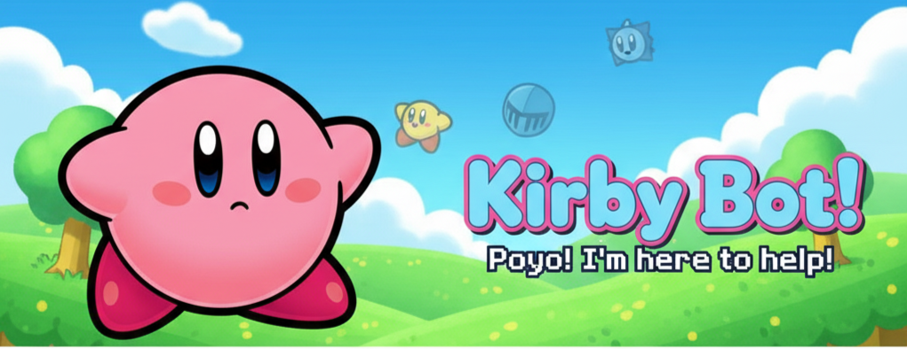

<div align="center">

# Kirby Dream · Bot de WhatsApp (Baileys)




<p>
  <strong>Economía • Casino • Stickers • Audios • Gacha • Panel • Eventos</strong><br/>
  Un bot modular y kawaii para WhatsApp, construido sobre Baileys.
  <br/>
</p>

<p>
  <a href="https://nodejs.org/en"></a>
  <a href="LICENSE"></a>
  <a href="https://v0-kirby-dream-web.vercel.app"></a>
  
  
</p>

<sup>Tip: Presiona la tecla “.” en GitHub para abrir el editor web.</sup>

</div>

> Kirby Dream es un bot modular de WhatsApp con enfoque kawaii: economía con KirbyCoins, juegos de casino, stickers, gacha, audios, panel web y eventos temáticos como el módulo navideño.

## Tabla de contenidos
- [Características](#características)
- [Demostración visual](#demostración-visual)
- [Demostración rápida](#demostración-rápida)
- [Requisitos](#requisitos)
- [Instalación](#instalación)
- [Configuración (env)](#configuración-env)
- [Plantilla .env rápida](#plantilla-env-rápida)
- [Ejecución](#ejecución)
- [Estructura del proyecto](#estructura-del-proyecto)
- [Comandos destacados](#comandos-destacados)
- [Panel web](#panel-web)
- [Copias de seguridad y datos](#copias-de-seguridad-y-datos)
- [Despliegue](#despliegue)
- [Solución de problemas](#solución-de-problemas)
- [FAQ](#preguntas-frecuentes-faq)
- [Roadmap](#roadmap)
- [Contribuir](#contribuir)
- [Créditos](#créditos)
- [Licencia](#licencia)

## Características

| Módulo | Qué incluye |
|---|---|
| Economía | KirbyCoin (₭), rachas, banco, transferencias, tier Elite |
| Casino | Blackjack, dados, slots, plinko, crash, ruleta y más |
| Stickers | Creación desde imagen/video, packs, metadatos, favoritos |
| Audios | Triggers, reproducción manual/aleatoria, TTS |
| Gacha | Raridades, tienda e intercambio |
| Navidad | Regalos diarios con racha, calendario de adviento, Santa |
| Panel | Panel web sencillo para administración |

<details>
<summary>¿Por qué elegir Kirby Dream? ✨</summary>

- Modular y fácil de extender
- Persistencia simple en JSON (sin DB externa)
- Compatible con Node ≥ 20 y Baileys
- Estilo kawaii con mensajes y tarjetas bonitas

</details>

## Demostración rápida

```bash
# 1) Instala dependencias
npm install

# 2) Copia variables de entorno
cp .env.example .env

# 3) Ejecuta en modo dev (autoreload)
npm run dev

# Escanea el QR en consola para vincular la sesión
```

## Demostración visual

<div align="center">


<p><em>Panel y tarjetas kawaii con economía y casino</em></p>

</div>

## Requisitos
- Node.js >= 20.0.0
- Cuenta de WhatsApp en un dispositivo para vincular con código QR (Baileys)
- ffmpeg (para procesamiento de medios, usa `ffmpeg-static` + `fluent-ffmpeg`)

## Instalación
1) Clona el repositorio y entra al proyecto.
2) Instala dependencias:

```bash
npm install
```

3) Copia variables de entorno base:

```bash
cp .env.example .env
```

4) Edita `.env` según tus necesidades.

## Configuración (env)
Variables soportadas más comunes:

- BOT_NAME=Kirby Dream
- PREFIX=$
- DATA_DIR=./data
- SESSION_DIR=./session
- LOG_LEVEL=info
- CHRISTMAS_ENABLED=true
- NEKOS_BEST_API_KEY= (opcional)
- WAIFU_IM_API_KEY= (opcional)

Además, puedes definir estas desde el entorno del sistema. Algunas también se reflejan en `config.js`.

## Plantilla .env rápida

```env
BOT_NAME=Kirby Dream
PREFIX=$
DATA_DIR=./data
SESSION_DIR=./session
LOG_LEVEL=info
CHRISTMAS_ENABLED=true
# Opcionales
NEKOS_BEST_API_KEY=
WAIFU_IM_API_KEY=
```

## Ejecución
- Desarrollo (con autoreload):

```bash
npm run dev
```

- Producción/simple:

```bash
npm start
```

- Panel web (opcional):

```bash
npm run server
```

La primera vez, el bot te pedirá escanear un QR en consola para vincular tu sesión. Las credenciales se guardan en `session/`.

## Estructura del proyecto
Estructura principal (resumen):

```
comandos/
  economia/      # Economía (daily, work, givecoins, etc.)
  casino/        # Juegos (blackjack, dice, slots, plinko...)
  navidad/       # Evento navideño (regalo, adviento, santa)
  stickers/      # Gestión de stickers
  audios/        # Gestión y reproducción de audios
panel/           # Panel web (Express)
utils/           # Utilidades compartidas
models/          # Modelos IA opcionales (gpt4all/gguf)
assets/          # Recursos visuales (banner, iconos)
session/         # Credenciales Baileys (no subir a git)
data/            # JSONs de persistencia (no subir a git)
index.js         # Punto de entrada del bot
server.js        # Servidor del panel (opcional)
config.js        # Config global (prefijo, eventos, etc.)
```

## Comandos destacados
Los comandos usan el prefijo configurado (`$` por defecto). Ejemplos:

- Economía
  - `$register` Regístrate en la economía.
  - `$daily` Recompensa diaria con racha y buffs de mascota.
  - `$work` Trabaja para ganar ₭.
  - `$givecoins @user 5000` Envía ₭ a otro usuario.

- Casino
  - `$dice 5000` Dados contra la casa.
  - `$blackjack 10000` Blackjack clásico.
  - `$slots 2500` Tragamonedas.
  - `$roulette 1000 rojo` Ruleta (puede variar por implementación disponible: `roulette`/`rouletteplus`).
  - Otros: `crash`, `plinko`, etc.

- Navidad
  - `$regalo` Regalo navideño diario con racha (respeta `CHRISTMAS_ENABLED`).
  - `$adviento [día]` Reclama del 1 al 24 de diciembre.
  - `$santa @user 5000` Regala ₭ a otro usuario.

- Stickers
  - `$sticker` Crea sticker a partir de imagen/video citado.
  - Gestores de packs, importaciones, metadatos, favoritos, etc.

- Audios
  - `$playaudio <trigger>` Reproduce un audio registrado.
  - `$tts es Hola mundo` Texto a voz.

Nota: La lista completa es extensa; revisa la carpeta `comandos/` para descubrir todos.

<details>
<summary><strong>Más comandos por módulo</strong></summary>

<details>
<summary>Economía</summary>

- `$register`, `$daily`, `$work`, `$fish`, `$mine`, `$givecoins`, `$economyboard`

</details>

<details>
<summary>Casino</summary>

- `$dice`, `$blackjack`, `$slots`, `$plinko`, `$crash`, `$roulette`/`$rouletteplus`

</details>

<details>
<summary>Navidad</summary>

- `$regalo`, `$adviento [día]`, `$santa @user <monto>`

</details>

<details>
<summary>Stickers</summary>

- `$sticker`, gestores de packs: `newpack`, `stickeradd`, `stickerdel`, `stickerpacks`, etc.

</details>

<details>
<summary>Audios</summary>

- `$playaudio <trigger>`, `$randomaudio`, `$tts <lang> <texto>`

</details>

</details>

## Panel web
- Código en `panel/` (Express + vistas).
- Scripts: `npm run server` abre el servidor del panel.
- Útil para administrar audios, ver estado, etc. (según lo implementado en tu build).

## Copias de seguridad y datos
- Datos persistentes en `data/` (usuarios, audios, gacha, etc.).
- Recomendado automatizar respaldos de `data/` y `session/` periódicamente.
- Algunos comandos generan backups en `data/backups/`.

## Despliegue
- Requisitos: Node 20+, disco con lectura/escritura, apertura a Internet para WhatsApp Web.
- Usualmente se corre en una VPS (pm2 o servicio del sistema) o en una máquina con Node.
- pm2 ejemplo:

```bash
npm i -g pm2
pm2 start index.js --name kirby-dream
pm2 save
```

## Solución de problemas

> Consejo: si algo falla, ejecuta con más logs ajustando `LOG_LEVEL` o revisa la salida de `nodemon`.
- No aparece QR
  - Asegúrate de no tener múltiples instancias levantadas (puertos y locks).
  - Elimina `session/` si necesitas forzar nuevo emparejamiento.
- ffmpeg no funciona
  - En Windows, `ffmpeg-static` debería funcionar; si no, instala ffmpeg en PATH.
- Capas de permisos de archivos
  - Verifica permisos en `data/` y `session/`.
- Errores por versión de Node
  - Requiere Node >= 20. Actualiza tu entorno.

## Roadmap

- [ ] Comandos de eventos adicionales (Pascua, Halloween)
- [ ] Leaderboards web y perfiles visuales
- [ ] Integración de mini-juegos HTML5 en el panel
- [ ] Soporte multi-idioma (ES/EN)
- [ ] Plugins de terceros con hot-reload

## Contribuir

¡PRs bienvenidos! Sugerencias y mejoras son bien recibidas.

1. Forkea el repo y crea una rama: `feat/mi-mejora`
2. Ejecuta en dev: `npm run dev`
3. Asegura estilo y funcionalidad, agrega ejemplos en el README si aplica
4. Abre tu Pull Request describiendo cambios y pruebas

## Créditos

- Construido con [Baileys](https://github.com/WhiskeySockets/Baileys)
- Inspiración kawaii por la comunidad de WhatsApp bots
- Assets de ejemplo en `assets/`

## Preguntas frecuentes (FAQ)
- ¿Puedo cambiar el prefijo?
  - Sí, en `.env` (`PREFIX`) o ajustando `config.js`.
- ¿Cómo desactivo el evento navideño?
  - Pon `CHRISTMAS_ENABLED=false` en `.env` o variable de entorno.
- ¿Puedo añadir mis propios audios/stickers?
  - Sí. Guarda audios en `audios/` y usa los comandos de gestión de audios; stickers se gestionan en `comandos/stickers/`.
- ¿Dónde se guardan los usuarios y monedas?
  - En `data/`, principalmente `data/*users*.json` según la implementación.

## Licencia
MIT © 2025 Kirby Dream
